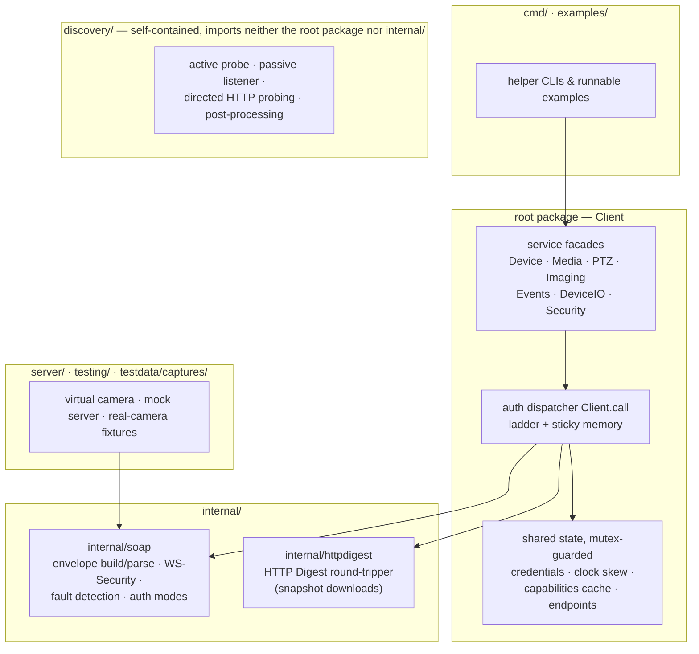
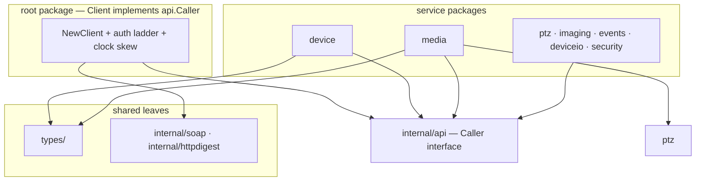

# Architecture

onvif-go is a zero-dependency Go library for talking to ONVIF devices, plus a
virtual camera server for testing recorders without hardware. This document
describes how the pieces fit together.

## Layering



## Package layout (v2)

The v1 single-package facade made the root directory flat. v2 (issue #20)
splits by domain — the `internal/api.Caller` interface breaks the import
cycle that previously made a split impossible:

| Package | Domain |
|---|---|
| root (`onvif`) | `Client` (implements `api.Caller`), auth strategy/ladder/diagnostics, download, v1 compatibility aliases |
| `types/` | shared data-model leaf (IPAddress, IntRectangle, ranges, SimpleItem, shared sentinels) |
| `device/` | tds: identity, capabilities (+cache), system, network, DNS/NTP, storage, WiFi |
| `security/` | users, access policy, certificates, IP filter |
| `deviceio/` | tmd: relays, digital I/O, serial ports |
| `media/` | trt: profiles, main/sub selection, StreamSetup, encoder/audio/OSD |
| `ptz/`, `imaging/` | tptz / timg domains |
| `events/` | tev: pull-point primitives + managed subscriptions |
| `discovery/` | client-side discovery (probe / listener / directed / post-processing) |
| `server/` | device-side framework (transport, handlers, simulator) |
| `internal/api` | the `Caller` interface between Client and services |
| `internal/soap`, `internal/httpdigest` | SOAP transport + WS-Security; HTTP Digest round-tripper |



The v1-style surface keeps compiling through root-package aliases
(`type Profile = media.Profile`, facade accessors unchanged); see
[v2-architecture.md](v2-architecture.md) for the migration map.


## The service-facade model

The `Client` is a connection and configuration holder; every ONVIF operation
lives on the service object that owns it, mirroring the ONVIF service model:

```go
client.Device().GetDeviceInformation(ctx)
client.Media().GetProfiles(ctx)
client.PTZ().ContinuousMove(ctx, token, speed, timeout)
```

Facades are stateless views: accessors construct them on demand, which keeps
a single `Client` safe to share across goroutines without facade-level
locking (see [concurrency.md](concurrency.md)).

## The single call path

All ~220 service operations route through one dispatcher,
[`Client.call`](../#client-configuration). It:

1. snapshots the auth configuration (primary mode, fallback ladder, sticky
   result) under the read lock,
2. builds a stateless SOAP exchange for the chosen mode,
3. retries auth-class failures through the ladder and remembers the first
   working mode,
4. wraps auth-class failures so `errors.Is(err, ErrUnauthorized)` always
   holds.

One audited path is also what makes the concurrency contract provable — see
[authentication.md](authentication.md) for the ladder semantics.

## SOAP transport (internal/soap)

A per-call, stateless client that:

- builds the envelope and the WS-Security header for the configured mode
  (digest, password-text, or none) or sets HTTP Basic auth,
- **detects SOAP Faults on every call regardless of HTTP status** — ONVIF
  devices frequently return faults with HTTP 200, and before fault detection
  existed such responses were mistaken for success on void operations,
- returns structured errors: `*FaultError` (code/subcode/reason, both SOAP
  1.1 and 1.2 layouts, any namespace prefix) and `*HTTPStatusError`.

## Capability XAddr repair

Cameras frequently advertise service endpoints (`GetCapabilities` XAddrs)
with loopback addresses or stale IPs after roaming to a new address. Since
the client reached the device through its device-service URL, that URL's
host is authoritative: mismatching XAddr hosts are rewritten (preserving the
service-specific port) during `Initialize`.

## Why discovery does not import the root package

The `discovery` package is deliberately self-contained: it ships its own
minimal SOAP probing (HTTP POST + regex/xml extraction) so that consumers
who only need discovery do not pull in the full client, and so the package
can never develop an import cycle with the root package.
