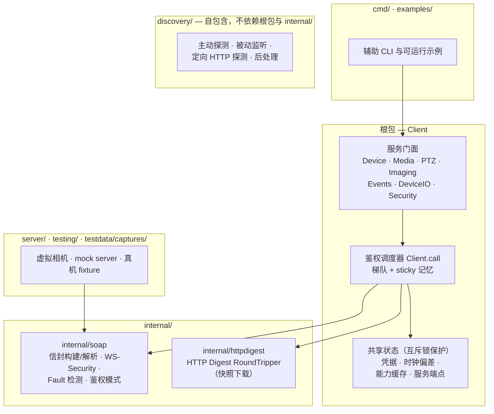

# 架构

onvif-go 是一个零第三方依赖的 Go 库，用于与 ONVIF 设备通信，另附一个虚拟摄像头服务器，
让你在没有实体相机的情况下测试录像软件。本文说明各组件如何协作。

## 分层



## 文件地图

根包刻意保持为单一 Go 包——门面 API（`client.Media().GetProfiles(ctx)`）
只有在服务类型与其方法同包时才成立——因此架构由文件布局来表达：

| 文件 | 职责 |
|---|---|
| `client.go` | `Client`、函数式选项、单一调用调度器、端点/XAddr 修复 |
| `auth.go` | 鉴权策略（模式、梯队记忆）、时钟偏差测量、`DiagnoseAuth` |
| `capabilities.go` | 能力缓存（single-flight + 弱设备降级） |
| `services.go` | 七个服务门面类型及其访问器 |
| `errors.go` | 包级哨兵错误与 `ONVIFError` |
| `types.go` | 共享 ONVIF 数据类型 |
| `device.go` | 设备身份、能力、scope、用户、杂项 `tds` 操作 |
| `device_mgmt.go` | 系统日期/时间、DNS/NTP、网络接口与网关 |
| `device_security.go` | 用户/远程用户、访问策略、证书 |
| `device_storage.go`、`device_wifi.go` | 存储与 WiFi 子系统 |
| `deviceio.go` | 继电器输出、数字 I/O |
| `media_profiles.go` | profile 列表/解析 + 主/子码流选择 |
| `media_stream.go` | 流与快照 URI、`StreamSetup` 传输选择 |
| `media_encoder.go`、`media_audio.go`、`media_osd.go` | 编码、音频、OSD 配置 |
| `ptz.go`、`imaging.go` | PTZ 与成像服务 |
| `event.go` | 原始 PullPoint 原语 + 托管订阅循环 |
| `download.go` | 快照/媒体文件下载（basic + digest） |

## 服务门面模型

`Client` 是「连接 + 配置」的载体；每个 ONVIF 操作挂在其所属的服务对象上，
与 ONVIF 服务模型一一对应：

```go
client.Device().GetDeviceInformation(ctx)
client.Media().GetProfiles(ctx)
client.PTZ().ContinuousMove(ctx, token, speed, timeout)
```

门面是无状态视图：访问器按需构造，因此单个 `Client` 可以安全地跨 goroutine
共享，门面层无需加锁（见 [并发模型](concurrency.md)）。

## 单一调用路径

全部约 220 个服务操作都经过同一个调度器 `Client.call`，它负责：

1. 读锁快照当前鉴权配置（主模式、回退梯队、sticky 结论）；
2. 为所选模式构建无状态 SOAP 交换；
3. 遇鉴权类失败时按梯队重试，并记住第一个可用的模式；
4. 包装鉴权类失败，保证 `errors.Is(err, ErrUnauthorized)` 恒成立。

单一可审计路径也让并发契约可证明——梯队语义详见[鉴权与安全](authentication.md)。

## SOAP 传输层（internal/soap）

每次调用构建一个无状态 client，职责：

- 按配置的模式构建信封与 WS-Security 头（digest、password-text 或不加），
  或改用 HTTP Basic；
- **无论 HTTP 状态如何都检测 SOAP Fault**——ONVIF 设备经常以 HTTP 200 携带
  Fault，在引入 Fault 检测之前，这类响应在无返回值操作上会被误判为成功；
- 返回结构化错误：`*FaultError`（code/subcode/reason，兼容 SOAP 1.1/1.2
  两种布局、任意命名空间前缀）与 `*HTTPStatusError`。

## 能力 XAddr 修复

相机在 `GetCapabilities` 里宣传的服务端点（XAddr）经常带着回环地址，或
漫游换 IP 后的陈旧地址。由于客户端是通过 device_service URL 连上设备的，
该 URL 的主机名才是权威依据：`Initialize` 时会把不一致的 XAddr 主机改写
（保留服务专属端口）。

## 为什么 discovery 不依赖根包

`discovery` 包刻意自包含：自带最小化的 SOAP 探测（HTTP POST + 正则/XML
提取），只需要发现功能的消费者不必引入完整 client，也永远不可能与根包
形成导入环。
